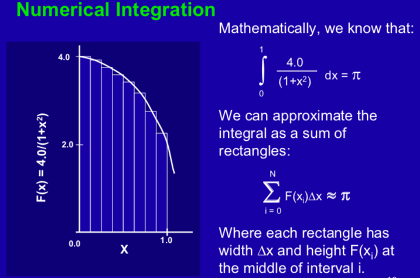

<!-- TODO: Corretude.pdf, passar a formato README, mover exercicio para pasta separada, postar exercicios do Matson em pasta separada -->

# Aulas da disciplina Laboratório de Introdução à Programação Paralela -- OpenMP
### Ementa: Práticas em laboratório para introdução aos conceitos básicos de programação paralela. Modelos e ambientes para programação paralela. Corretude da execução concorrente em sistemas de memória compartilhada. Técnicas de paralelização. Algoritmos paralelos. Avaliação de desempenho em computação paralela. 

Aula baseada nos slides em https://www.openmp.org/wp-content/uploads/omp-hands-on-SC08.pdf. Pré-requisito: leitura do capítulo 1 do livro do Pacheco.
Na última aula fizemos uma introdução à OpenMP. Nessa aula iremos aprofundar no desenvolvimento de programas OpenMP em C/C++ por meio de vários exemplos. [Esse arquivo ](./OpenMP-4.0-C.pdf) contém uma Quick Reference Card de OpenMP 4.0.


 
## OpenMP — programa paralelo — memória compartilhada
Crie o arquivo `main.cpp` contendo o seguinte código:

```cpp
#include <iostream>
#include <omp.h> //arquivo include openmp
using namespace std;

int main(int argc, char *argv[])
{
    // Inicio da regiao paralela, a clausula num_threads solicita um determinado número de threads
    #pragma omp parallel num_threads(4)
    {
        cout << omp_get_thread_num() << "\n"; // funcao da biblioteca runtime, retorna o ID (rank) da thread
    }
    //Fim da regiao paralela
    return 0;
}
```
[O que o compilador faz](./compilerOpenMP.png)

**Boa política! Em caso de necessidade de desabilitar as directivas OpenMP, é possível usar compilação condicional. O seguinte exemplo demostra o uso de compilação condicional usando a macro OpenMP _OPENMP . Ao compilar OpenMP, a macro _OPENMP é definida.

```cpp
#include <stdio.h>
int main() {
# ifdef _OPENMP
   printf("Compiled by an OpenMP-compliant implementation.\n");
# endif
   return 0; 
}
```

Lembrete: Para compilar e executar o programa:

```bash
$ g++ -fopenmp main.cpp -o output
$ ./output
```

OpenMP segue um modelo multi-thread de memória compartilhada. As threads se comunicam de forma implícita compartilhando variáveis: uma thread escreve na variável e a outra lê. O acesso concorrente não protegido a essas variáveis causa condições de corrida. (A saída do programa depende da ordem de execução das threads)
–- Uma solução é o uso de sincronização. Mas sincronização serializa a execução de seu código. Melhor: minimize a necessidade de sincronização. 

[Veja o material sobre corretude na programação paralela](./corretude.pdf)

## Exercício: 


Solução sequencial. Veja o uso da função omp_get_wtime()

```cpp
#include <stdio.h>
#include <omp.h>
static long num_steps = 1000000;
double step;
int main ()
{
	  int i;
	  double x, pi, sum = 0.0;
	  double start_time, run_time;

	  step = 1.0/(double) num_steps;

        	 
	  start_time = omp_get_wtime();

	  for (i=1;i<= num_steps; i++){
		  x = (i-0.5)*step;
		  sum = sum + 4.0/(1.0+x*x);
	  }

	  pi = step * sum;
	  run_time = omp_get_wtime() - start_time;
	  printf("\n pi with %d steps is %f in %f seconds ",num_steps,pi,run_time);
}	  
```

Solução paralela: (tente resolver sem ver a solução!)
```cpp
The program was parallelized using OpenMP and an SPMD 
algorithm.  The following OpenMP specific lines were 
added: 

(1) A line to include omp.h -- the include file that 
contains OpenMP's function prototypes and constants.

(2) A pragma that tells OpenMP to create a team of threads
with an integer variable i being created for each thread.

(3) two function calls: one to get the thread ID (ranging
from 0 to one less than the number of threads), and the other
returning the total number of threads.

(4) A cyclic distribution of the loop by changing loop control
expressions to run from the thread ID incremented by the number 
of threads.  Local sums accumlated into sum[id].

Note that this program will show low performance due to 
false sharing.  In particular, sum[id] is unique to each
thread, but adfacent values of this array share a cache line
causing cache thrashing as the program runs.

History: Written by Tim Mattson, 11/99.

*/

#include <stdio.h>
#include <omp.h>

#define MAX_THREADS 4

static long num_steps = 100000000;
double step;
int main ()
{
	  int i,j;
	  double pi, full_sum = 0.0;
	  double start_time, run_time;
	  double sum[MAX_THREADS];

	  step = 1.0/(double) num_steps;


   for (j=1;j<=MAX_THREADS ;j++) {

      omp_set_num_threads(j);
      full_sum=0.0;
      start_time = omp_get_wtime();

      #pragma omp parallel
      {
        int i;
	  int id = omp_get_thread_num();
	  int numthreads = omp_get_num_threads();
	  double x;

	  sum[id] = 0.0;

        if (id == 0) 
             printf(" num_threads = %d",numthreads);

	  for (i=id;i< num_steps; i+=numthreads){
		  x = (i+0.5)*step;
		  sum[id] = sum[id] + 4.0/(1.0+x*x);
	  }
      }

	for(full_sum = 0.0, i=0;i<j;i++)
	    full_sum += sum[i];

      pi = step * full_sum;
      run_time = omp_get_wtime() - start_time;
      printf("\n pi is %f in %f seconds %d thrds \n",pi,run_time,j);
   }
}
```

Ambiente de dados em OpenMP:
```cpp
void simple(int n, float *a, float *b)
{
int i;
#pragma omp parallel for
    for (i=1; i<n; i++) /* i is private by default */
}

```

https://ava.cefetmg.br/pluginfile.php/8569/mod_resource/content/1/Intro_To_OpenMP_Mattson.pdf
